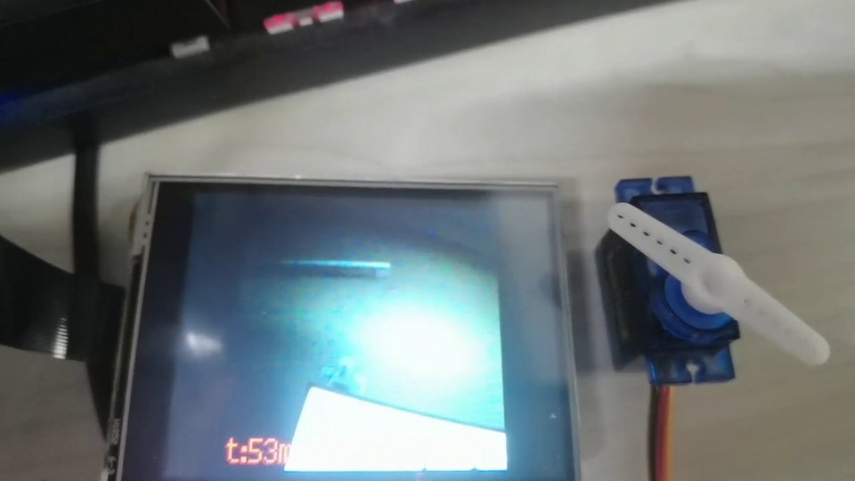
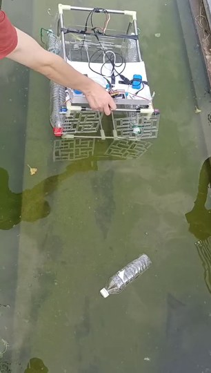
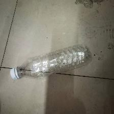

# Water Surface Trash Cleaning Robot

本科大创项目归档与展示：基于视觉识别技术的水面垃圾自动清理机器人设计。

This repository organizes the code, model files, sample data, project documents, and demo media from an undergraduate innovation project on a water-surface trash cleaning robot.

## Project Snapshot





## 中文简介

本项目面向水面漂浮垃圾自动清理场景，完成了一个结合嵌入式视觉识别与执行机构控制的小型机器人原型。项目使用 K210 边缘 AI 开发板运行 MaixPy/KPU 目标检测程序，并通过 PCA9685 PWM 控制舵机、电机等执行机构，形成“视觉感知 - 控制输出 - 样机动作”的工程闭环。

本仓库用于整理本科大创项目的代码、模型、文档与演示材料，方便集中查看项目过程和技术实现。

## Repository Structure

```text
.
├── src/maixpy/              # MaixPy source code for K210 vision and actuator control
├── models/                  # K210 model and training report
├── data/                    # Sample images, labels, and XML annotations
├── docs/proposal/           # Proposal, midterm report, and project PDF
├── docs/presentations/      # Defense and progress presentation slides
├── media/images/            # README preview images and extracted demo frames
├── media/videos/            # Project demo videos
├── hardware/                # Hardware notes and wiring summary
└── archive-notes/           # Notes about excluded local materials
```

## Technical Stack

- Embedded vision: Kendryte K210, MaixPy, KPU
- Detection pipeline: YOLO2-style object detection deployment on K210
- Input size: `224 x 224`
- Hardware control: PCA9685 PWM driver, servos, motors, I2C
- Language: MicroPython / MaixPy Python

## Code Entry Points

- `src/maixpy/main.py`: unified detection and actuator-control script.
- `src/maixpy/boot.py`: minimal MaixPy boot file.
- `src/maixpy/motor.py`, `servo.py`, `stepper.py`, `pca9685.py`: actuator and PWM driver modules.

The main script initializes the camera and LCD, loads a `.kmodel`, performs object detection, draws detection results, and triggers servo actions after detection.

## Model Status

The current repository includes `models/model-11975.kmodel` and `models/training-report.json`. This model is retained as a K210 deployment and workflow-verification artifact from the project folder. Its report records an 8-class training configuration.

The project target is water-surface trash recognition, and the dataset in `data/` contains bottle/bag samples and XML annotations. A bottle/bag model configuration is preserved in `src/maixpy/main.py` as `TRASH_LABELS` and `TRASH_ANCHORS`, but the final trash-specific `.kmodel` was not separately identifiable in the archived local files. Therefore, this repository should be read as a project-process archive and embedded deployment demonstration, not as a fully packaged final model release.

## Dataset

- `data/labels.txt`: bottle/bag label definitions.
- `data/sample_images/`: sample images used for annotation and model workflow demonstration.
- `data/annotations/`: XML object-detection annotations.

## Hardware Deployment

Typical deployment steps:

1. Copy files from `src/maixpy/` and the selected `.kmodel` to the K210 board or TF card.
2. Adjust `MODEL_ADDR`, labels, and anchors in `src/maixpy/main.py`.
3. Connect the PCA9685 board through the I2C pins configured in the script.
4. Connect servos or motors to the expected PCA9685 output channels.
5. Power on the board and run the MaixPy script.

Hardware parameters such as I2C pins, servo channels, and detection thresholds should be checked against the actual robot wiring before running.

## Robotics-Relevant Skills

This project mainly demonstrates:

- Embedded vision deployment on K210/MaixPy.
- Object-detection model conversion and edge-device inference workflow.
- PWM servo control and motor driver usage through PCA9685.
- I2C-based actuator control.
- Perception-to-action integration in a physical prototype.
- Undergraduate-level system integration, debugging, and demonstration.

## Project Materials

Project documents and presentation materials are kept in `docs/`:

- Project proposal and midterm materials in `docs/proposal/`
- Initial, midterm, and final defense slides in `docs/presentations/`

Demo videos are kept in `media/videos/`. A Chinese project index is available in `PROJECT_MATERIALS.md`.

## Notes

This repository is a curated public version of the original project folder. Personal resume files, unrelated software packages, third-party development kits, executable tools, and oversized compressed archives were excluded. See `archive-notes/original-materials.md` for details.

## License

Project code and self-created materials are shared for academic review and project documentation. Third-party materials remain owned by their original authors and are not redistributed here.
